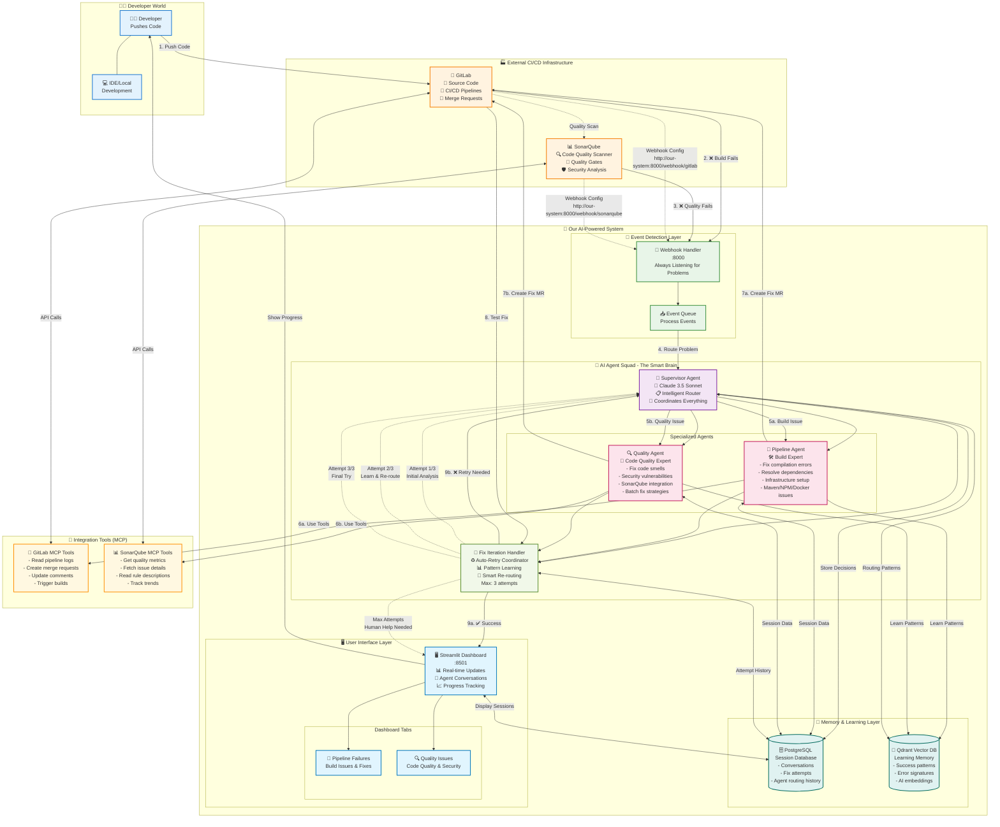
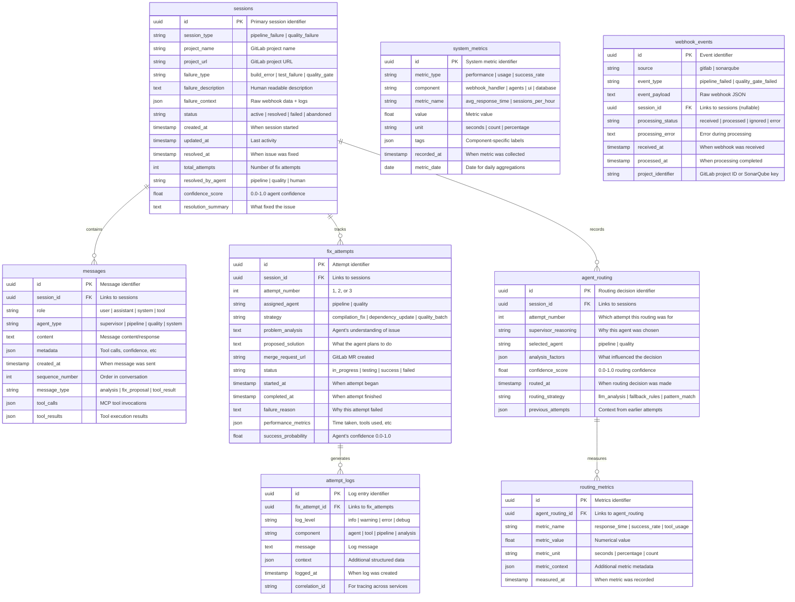
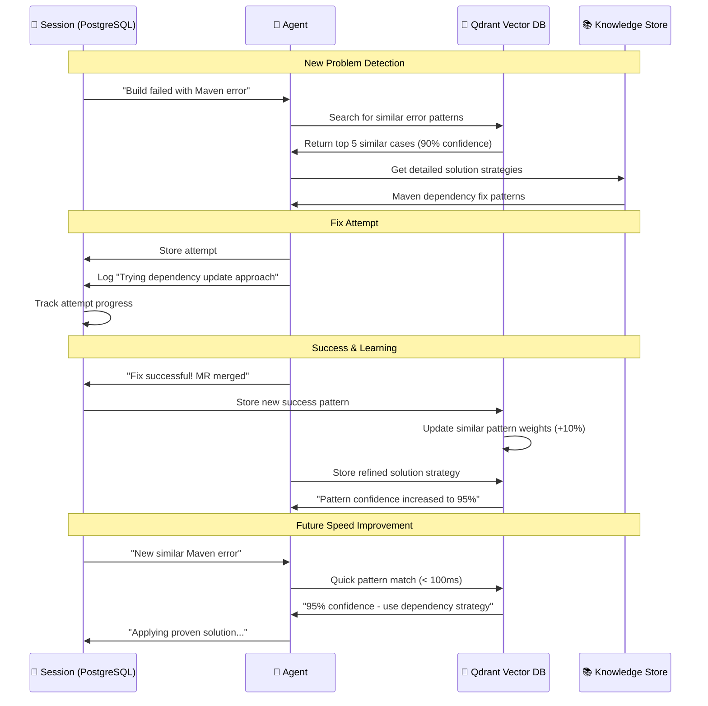

# 🏗️ Complete System Architecture - Single Unified Diagram

## 🎯 AWS Strands Agent Squad CI/CD Failure Analysis System

**What this system does in simple terms:**
- 🔍 Automatically detects when your code builds fail or have quality issues
- 🤖 Uses AI agents to analyze and fix problems intelligently  
- 🔄 Automatically retries fixes up to 3 times with learning
- 📊 Shows progress in a friendly web dashboard
- 🧠 Gets smarter over time by learning from successes and failures



## 🔄 How the Auto-Retry System Works

**Simple Example: "mvn: command not found" in SonarQube**

1. **🔍 Problem Detected**: SonarQube stage fails with "mvn: command not found"
2. **🎯 Supervisor Analysis**: "This is an infrastructure issue, not a quality issue"
3. **🔧 Route to Pipeline Agent**: "You handle build tools and infrastructure"
4. **🛠️ Pipeline Agent Fixes**: Adds Maven to Docker container configuration
5. **🧪 Test the Fix**: GitLab runs the pipeline again
6. **✅ Success or 🔄 Retry**: If it works, celebrate! If not, try a different approach

## 📊 Key System Benefits

| Feature | Description | Benefit |
|---------|-------------|---------|
| **🧠 Intelligent Routing** | Supervisor Agent uses AI to choose the right specialist | Higher success rate than hardcoded rules |
| **🔄 Auto-Retry with Learning** | System tries up to 3 times, learning each time | Handles complex issues that need multiple approaches |
| **🎯 Specialized Agents** | Different AI experts for different problem types | More accurate fixes for specific issue categories |
| **📚 Pattern Learning** | Stores successful solutions in vector database | Gets smarter over time, faster fixes for similar issues |
| **🖥️ Real-time Dashboard** | Live updates on fix progress and agent conversations | Developers stay informed without manual checking |

## 🚀 Container Deployment

```bash
# All services run in Docker containers
docker-compose up -d

# Services and Ports:
# 📡 Webhook Handler:    localhost:8000
# 🤖 Agent Squad:        localhost:8001  
# 🖥️ Streamlit UI:       localhost:8501
# 🗄️ PostgreSQL:         localhost:5432
# 🧠 Qdrant Vector DB:   localhost:6333
```

## 🗄️ Database Schema Architecture

### 📊 PostgreSQL Database Schema

**What we store in PostgreSQL:**
- 💬 Agent conversations and sessions
- 🔄 Fix attempt history and outcomes
- 🎯 Agent routing decisions and performance
- 📈 System metrics and analytics



### 🧠 Qdrant Vector Database Schema

**What we store in Qdrant Vector DB:**
- 🎯 Successful fix patterns and strategies
- 🔍 Error signature embeddings for pattern matching
- 📚 Knowledge base of solutions and best practices
- 🧠 Agent learning and experience memories

```mermaid
graph TB
    subgraph "🧠 Qdrant Vector Database Collections"
        
        subgraph "📚 fix_patterns Collection"
            FP1[🎯 Fix Pattern Vectors<br/>📊 Embedding Dimension: 1536<br/>🔢 Distance: Cosine<br/>📝 Indexed: HNSW]
            
            FP_PAYLOAD[📋 Payload Structure:<br/>- fix_strategy: string<br/>- success_count: int<br/>- agent_type: pipeline|quality<br/>- problem_category: string<br/>- solution_code: text<br/>- success_rate: float<br/>- last_used: timestamp<br/>- project_context: json]
        end
        
        subgraph "🔍 error_signatures Collection"
            ES1[🚨 Error Signature Vectors<br/>📊 Embedding Dimension: 1536<br/>🔢 Distance: Cosine<br/>📝 Indexed: HNSW]
            
            ES_PAYLOAD[📋 Payload Structure:<br/>- error_type: string<br/>- error_message_hash: string<br/>- language: java|python|node<br/>- build_tool: maven|npm|pip<br/>- frequency: int<br/>- known_solutions: array<br/>- difficulty_level: easy|medium|hard<br/>- detection_confidence: float]
        end
        
        subgraph "🎓 agent_knowledge Collection"
            AK1[🧠 Agent Knowledge Vectors<br/>📊 Embedding Dimension: 1536<br/>🔢 Distance: Cosine<br/>📝 Indexed: HNSW]
            
            AK_PAYLOAD[📋 Payload Structure:<br/>- knowledge_type: solution|pattern|best_practice<br/>- agent_specialization: pipeline|quality|supervisor<br/>- context_tags: array<br/>- effectiveness_score: float<br/>- usage_count: int<br/>- created_by_session: uuid<br/>- validation_status: verified|experimental<br/>- knowledge_source: agent_learning|manual]
        end
        
        subgraph "📈 success_patterns Collection"
            SP1[✅ Success Pattern Vectors<br/>📊 Embedding Dimension: 1536<br/>🔢 Distance: Cosine<br/>📝 Indexed: HNSW]
            
            SP_PAYLOAD[📋 Payload Structure:<br/>- session_id: uuid<br/>- fix_sequence: array<br/>- time_to_resolution: int<br/>- complexity_factors: json<br/>- replication_success: float<br/>- pattern_stability: float<br/>- environmental_context: json<br/>- learning_value: high|medium|low]
        end
    end
    
    subgraph "🔄 Vector Operations & Workflows"
        
        subgraph "📝 Data Ingestion Flow"
            NEW_SESSION[🆕 New Session] --> EXTRACT[🔍 Extract Features]
            EXTRACT --> EMBED[🧠 Generate Embeddings]
            EMBED --> STORE[💾 Store in Collections]
        end
        
        subgraph "🔍 Similarity Search Flow"
            QUERY[❓ Search Query] --> EMBED_Q[🧠 Embed Query]
            EMBED_Q --> SEARCH[🔍 Vector Search]
            SEARCH --> RANK[📊 Rank Results]
            RANK --> RETURN[📤 Return Matches]
        end
        
        subgraph "📚 Learning & Updates"
            SUCCESS[✅ Successful Fix] --> UPDATE_PATTERNS[📈 Update Success Patterns]
            UPDATE_PATTERNS --> BOOST_SIMILAR[⬆️ Boost Similar Vectors]
            FAILURE[❌ Failed Fix] --> ANALYZE_GAPS[🕳️ Analyze Knowledge Gaps]
            ANALYZE_GAPS --> CREATE_NEW[🆕 Create New Patterns]
        end
    end
    
    %% Collection Relationships
    FP1 -.->|References| SP1
    ES1 -.->|Links to| FP1
    AK1 -.->|Supports| FP1
    SP1 -.->|Validates| AK1
    
    %% Workflow Connections
    STORE -->|fix_patterns| FP1
    STORE -->|error_signatures| ES1
    STORE -->|agent_knowledge| AK1
    STORE -->|success_patterns| SP1
    
    SEARCH -.->|Query| FP1
    SEARCH -.->|Query| ES1
    SEARCH -.->|Query| AK1
    SEARCH -.->|Query| SP1
    
    classDef collection fill:#e3f2fd,stroke:#1976d2,stroke-width:2px
    classDef payload fill:#f3e5f5,stroke:#7b1fa2,stroke-width:2px
    classDef workflow fill:#e8f5e8,stroke:#388e3c,stroke-width:2px
    classDef operation fill:#fff3e0,stroke:#f57c00,stroke-width:2px
    
    class FP1,ES1,AK1,SP1 collection
    class FP_PAYLOAD,ES_PAYLOAD,AK_PAYLOAD,SP_PAYLOAD payload
    class NEW_SESSION,EXTRACT,EMBED,STORE,QUERY,EMBED_Q,SEARCH,RANK,RETURN workflow
    class SUCCESS,UPDATE_PATTERNS,BOOST_SIMILAR,FAILURE,ANALYZE_GAPS,CREATE_NEW operation
```

### 🔗 Database Integration & Data Flow

**How PostgreSQL and Qdrant work together:**



### 📊 Database Performance & Scaling

```mermaid
graph TB
    subgraph "🚀 PostgreSQL Performance"
        PG_IDX[📇 Indexes<br/>- session_id (B-tree)<br/>- created_at (B-tree)<br/>- status + session_type (Composite)<br/>- project_name (Hash)]
        
        PG_PART[🗂️ Partitioning<br/>- sessions by month<br/>- messages by session_id<br/>- metrics by date]
        
        PG_CONN[🔗 Connection Pooling<br/>- Max connections: 100<br/>- Pool size: 20<br/>- Async operations]
    end
    
    subgraph "⚡ Qdrant Performance"
        QD_HNSW[🕸️ HNSW Index<br/>- M: 16 (connections)<br/>- ef_construct: 200<br/>- ef: 128 (search)]
        
        QD_SHARD[🔀 Sharding<br/>- 2 shards per collection<br/>- Replication factor: 1<br/>- Load balancing]
        
        QD_CACHE[💾 Vector Cache<br/>- LRU eviction<br/>- Cache size: 512MB<br/>- Hit ratio: >90%]
    end
    
    subgraph "📈 Scaling Strategy"
        HORIZONTAL[↔️ Horizontal Scaling<br/>- Read replicas for PostgreSQL<br/>- Qdrant cluster nodes<br/>- Load balancer routing]
        
        VERTICAL[↕️ Vertical Scaling<br/>- CPU: 4-8 cores<br/>- RAM: 16-32 GB<br/>- SSD: 500GB-1TB]
        
        MONITORING[📊 Monitoring<br/>- Query performance<br/>- Vector search latency<br/>- Storage usage<br/>- Cache hit rates]
    end
    
    classDef postgres fill:#336791,color:#fff
    classDef qdrant fill:#ff6b6b,color:#fff
    classDef scaling fill:#4ecdc4,color:#fff
    
    class PG_IDX,PG_PART,PG_CONN postgres
    class QD_HNSW,QD_SHARD,QD_CACHE qdrant
    class HORIZONTAL,VERTICAL,MONITORING scaling
```

---

*This unified diagram shows the complete AWS Strands Agent Squad architecture for intelligent CI/CD failure analysis and auto-remediation. The system combines multiple AI agents, pattern learning, and auto-retry capabilities to automatically fix build failures and code quality issues.*
